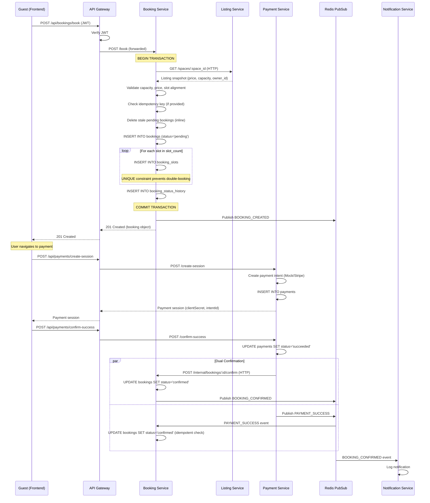
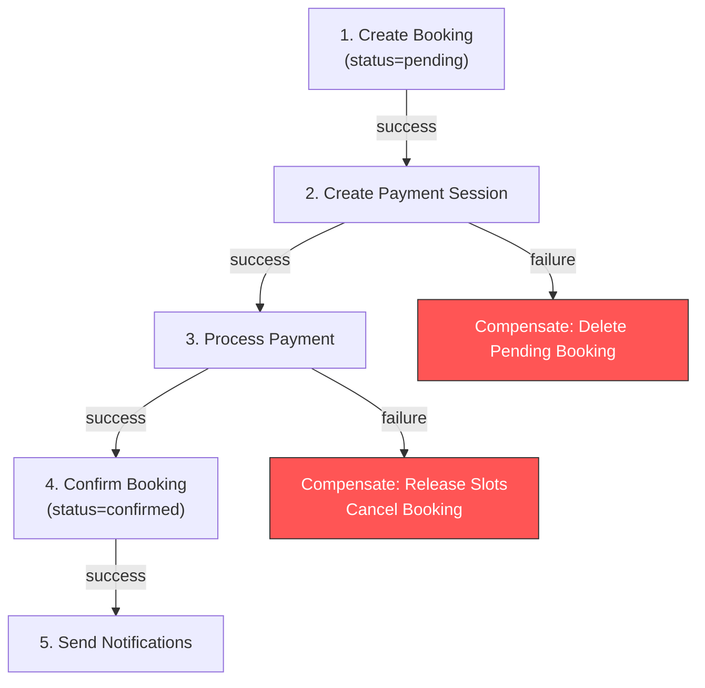

# SpaceShare Booking System — V1 Comprehensive Analysis Report

> **Version:** 1.0  
> **Date:** April 24, 2026  
> **Scope:** End-to-end analysis of the Booking subsystem, including interactions with Listing, Payment, Notification, and API Gateway services.

---

## Table of Contents

1. [Executive Summary](#1-executive-summary)
2. [Current System Architecture](#2-current-system-architecture)
3. [Booking Workflow Analysis](#3-booking-workflow-analysis)
4. [Capacity Estimation](#4-capacity-estimation)
5. [Concurrency & Consistency Analysis](#5-concurrency--consistency-analysis)
6. [Gap Analysis & Architectural Weaknesses](#6-gap-analysis--architectural-weaknesses)
7. [Lessons from Production Systems](#7-lessons-from-production-systems)
8. [Recommended Improvements](#8-recommended-improvements)
9. [Design Principles & Patterns Assessment](#9-design-principles--patterns-assessment)
10. [Architecture Tactics Assessment](#10-architecture-tactics-assessment)
11. [Prioritized Roadmap](#11-prioritized-roadmap)

---

## 1. Executive Summary

SpaceShare is a subscription-based co-working space marketplace where hosts list small spaces for hourly rental and guests search, discover, and book them. The system is implemented as a Node.js/Express microservices architecture with 8 backend services, PostgreSQL databases (Neon serverless), Redis for caching/pub-sub, and a React+Vite frontend.

### Current NFR Targets (from project requirements)

| NFR | Target |
|-----|--------|
| Availability | 99.99% |
| Performance (cache hit) | < 500 ms |
| Performance (cache miss) | < 1.5 sec |
| Concurrency | 200 simultaneous requests |
| Scalability | 500 baseline users, 2,000 peak users |
| Security | JWT expiry 24 hours |

### Key Findings

1. **The booking creation workflow is well-designed for correctness** — DB-level unique constraints on `booking_slots` prevent double-booking deterministically within a single database transaction.
2. **The system lacks critical resilience patterns** — No circuit breakers, no rate limiting, no bulkheads, and no retry with exponential backoff on inter-service calls.
3. **Payment-Booking coordination has a dual-confirmation path** (direct HTTP call + Redis pub/sub) that introduces redundancy risk but lacks a guaranteed delivery mechanism like an outbox pattern.
4. **The stale-pending-booking cleanup is commented out** in `server.js`, leaving orphaned pending bookings that permanently consume slot inventory.
5. **The API gateway is a naive pass-through proxy** with no rate limiting, no request queuing, no load shedding, and no circuit breaker support.
6. **There is no connection pooling tuning** — the PostgreSQL pool uses default `@neondatabase/serverless` settings with no `max`, `idleTimeoutMillis`, or `connectionTimeoutMillis` configured.

---

## 2. Current System Architecture

### 2.1 Service Topology

```
┌─────────────┐
│   Frontend   │  (React + Vite, port 5173)
│   (Browser)  │
└──────┬───────┘
       │ HTTPS
┌──────▼────────┐
│  API Gateway   │  (Express, port 4000)
│  (Proxy +Auth) │
└──┬──┬──┬──┬───┘
   │  │  │  │  HTTP (synchronous)
   │  │  │  │
┌──▼┐┌▼┐┌▼──┐┌─▼─────────┐
│Auth││Lst││Srch││Booking Svc │  (port 4004)
│4001││4002││4003││             │
└────┘└─┬─┘└────┘└──┬────┬────┘
        │           │    │
        │    ┌──────▼┐ ┌─▼──────────┐
        │    │Payment│ │Subscription│
        │    │ 4008  │ │   4005     │
        │    └───────┘ └────────────┘
        │
   ┌────▼──────┐    ┌───────────┐
   │Notification│    │ Analytics  │
   │   4006     │    │   4007    │
   └────────────┘    └───────────┘
              ▲            ▲
              └────┬───────┘
                   │  Redis Pub/Sub ("events" channel)
              ┌────┴────┐
              │  Redis   │ (port 6379)
              └──────────┘
```

### 2.2 Technology Stack

| Component | Technology | Purpose |
|-----------|-----------|---------|
| Runtime | Node.js + Express | All backend services |
| Database | PostgreSQL (Neon serverless) | Persistent storage per service |
| Cache / PubSub | Redis (ioredis) | Cache-aside for slots/search + event bus |
| Auth | JWT + bcrypt | Gateway and service-level authentication |
| Gateway Proxy | Axios (HTTP forwarding) | Request routing to downstream services |
| Payment | Stripe SDK + Mock Adapter | Adapter pattern for payment providers |
| Timezone | Luxon (listing-service) | Timezone-aware slot generation |

### 2.3 Database-per-Service Pattern

Each microservice owns its own Neon PostgreSQL database:

| Service | Database | Core Tables |
|---------|----------|-------------|
| Booking | `booking_db` | `bookings`, `booking_slots`, `booking_status_history` |
| Listing | `listing_db` | `spaces`, `listing_weekly_availability`, `listing_availability_overrides` |
| Payment | `payment_db` | `payments` |
| Auth | `auth_db` | `users` |
| Subscription | `subscription_db` | `subscriptions` |
| Analytics | `analytics_db` | `events` |

### 2.4 Inter-Service Communication Matrix

| Caller | Callee | Protocol | Path | Auth |
|--------|--------|----------|------|------|
| Booking → | Listing | HTTP GET | `/spaces/:id` | None (internal) |
| Listing → | Booking | HTTP GET | `/internal/listings/:space_id/reserved-slots` | `X-Internal-Token` |
| Listing → | Subscription | HTTP GET | `/me/:userId` | None |
| Payment → | Booking | HTTP POST | `/internal/bookings/:booking_id/confirm` | `X-Internal-Token` |
| Payment → | Redis | PubSub | `events` channel (`PAYMENT_SUCCESS`) | N/A |
| Booking → | Redis | PubSub | `events` channel (`BOOKING_CREATED`, `BOOKING_CONFIRMED`, `BOOKING_CANCELLED`) | N/A |
| Gateway → | All services | HTTP proxy | Various | Forwards `Authorization` header |

> [!WARNING]
> **Critical finding:** The `Booking → Listing` call to fetch listing snapshot (`/spaces/:id`) uses **no authentication token**. Any HTTP client on the internal network can query listing data. While this may be acceptable in a trusted Docker network, it deviates from the defense-in-depth tactic documented in the architecture.

---

## 3. Booking Workflow Analysis

### 3.1 End-to-End Booking Creation Flow



### 3.2 Booking State Machine

```
                  ┌──────────┐
                  │   new     │  (initial, transient)
                  └────┬─────┘
                       │ createBooking()
                  ┌────▼─────┐
           ┌──────│ pending   │──────────────┐
           │      └────┬─────┘              │
           │           │                    │
    payment fails /    │ payment succeeds   │ stale timeout /
    user deletes       │                    │ user cancels
           │      ┌────▼─────┐              │
           │      │confirmed │              │
           │      └────┬──┬──┘              │
           │           │  │                 │
           │    session ends  cancel        │
           │           │  │                 │
           │      ┌────▼┐ ┌▼────────┐  ┌───▼──────┐
           └─────>│deleted│ │cancelled│  │cancelled │
                  └──────┘ └─────────┘  └──────────┘
                                            │
                                    ┌───────▼───────┐
                                    │  completed     │
                                    │(booking ends)  │
                                    └────────────────┘
```

**Observed states:** `pending` → `confirmed` → `cancelled` / `completed`; or `pending` → `deleted` (cascade delete).

### 3.3 Key Booking Lifecycle Operations

| Operation | Endpoint | Auth | Key Logic |
|-----------|----------|------|-----------|
| Create Booking | `POST /book` | JWT (guest) | Transaction: validate listing → insert booking → insert slots → history |
| Cancel Booking | `POST /bookings/:id/cancel` | JWT (guest/host/admin) | Transaction: FOR UPDATE lock → update status → release slots → history |
| Delete Pending | `DELETE /bookings/:id/pending` | JWT (guest/host/admin) | Transaction: FOR UPDATE lock → hard delete → history |
| Get My Bookings | `GET /bookings/my` | JWT (guest) | Simple SELECT by user_id |
| Get Host Bookings | `GET /bookings/host/my` | JWT (host) | Simple SELECT by host_id |
| Confirm (internal) | `POST /internal/bookings/:id/confirm` | X-Internal-Token | Transaction: FOR UPDATE → update status → history → publish event |
| Get Reserved Slots | `GET /internal/listings/:space_id/reserved-slots` | X-Internal-Token | Query active booking_slots |

### 3.4 Slot Conflict Prevention Mechanism

The system uses a **partial unique index** on `booking_slots`:

```sql
CREATE UNIQUE INDEX IF NOT EXISTS uniq_active_space_slot
ON booking_slots(space_id, slot_start_utc)
WHERE occupancy_status = 'active';
```

**How it works:**
1. When a booking is created, each hourly slot is inserted into `booking_slots` with `occupancy_status = 'active'`.
2. The partial unique index ensures that for any given `(space_id, slot_start_utc)` pair, only **one** active slot can exist.
3. If two concurrent transactions try to insert the same slot, one will receive PostgreSQL error code `23505` (unique violation).
4. The application catches this and throws `'Space is already booked for this time slot'`.

> [!NOTE]
> This is a **robust strategy** — it pushes conflict detection into the database engine's MVCC layer, which is the strongest correctness guarantee available in a single-database setup. This aligns with how Booking.com handles "property-level transactions."

### 3.5 Payment Window & Stale Booking Cleanup

The system implements a **payment window** concept:
- On booking creation, `payment_window_started_at` and `payment_window_expires_at` are set.
- Default window: **60 seconds** (`PAYMENT_UI_WINDOW_SECONDS`).
- Stale bookings (pending beyond `STALE_PENDING_RELEASE_SECONDS = 120s`) are cleaned up:
  - **Inline:** During new booking creation, stale bookings for the same slot are deleted within the transaction.
  - **Background:** A periodic cleanup was implemented but is **currently commented out** in `server.js` (lines 40-51).

> [!CAUTION]
> **The background cleanup is disabled.** This means:
> - If a user creates a booking and never pays, the pending booking **blocks those slots indefinitely** unless another user happens to book the same slot (triggering inline cleanup).
> - Over time, this could lead to "phantom inventory loss" where available slots appear unavailable because of abandoned pending bookings.

---

## 4. Capacity Estimation

### 4.1 Given Parameters (from requirements)

| Parameter | Value |
|-----------|-------|
| Baseline users | 500 |
| Peak users | 2,000 |
| Concurrency target | 200 simultaneous requests |
| Availability target | 99.99% (≈ 52.6 min downtime/year) |
| JWT expiry | 24 hours |

### 4.2 Traffic Estimation

#### User Behavior Assumptions

| Behavior | Estimate | Rationale |
|----------|----------|-----------|
| Average session length | 8 minutes | Short-session booking app (browsing + booking) |
| Sessions per user per day | 1.5 | Most users check once, some return to confirm |
| Actions per session | 12 | 5 search queries + 3 listing views + 2 slot checks + 1 booking attempt + 1 payment |
| Read:Write ratio | 20:1 | Search/browse dominates; booking writes are rare |
| Booking conversion rate | 5% of sessions | Industry standard for marketplace booking |

#### Baseline Load (500 users)

```
Daily sessions           = 500 × 1.5      = 750 sessions/day
Daily requests           = 750 × 12       = 9,000 requests/day
Daily bookings           = 750 × 0.05     = 37.5 ≈ 38 bookings/day

Average QPS (total)      = 9,000 / 86,400 ≈ 0.10 QPS
Average QPS (reads)      = 0.10 × (20/21) ≈ 0.095 QPS
Average QPS (writes)     = 0.10 × (1/21)  ≈ 0.005 QPS (≈ 0.4 bookings/hour)
```

#### Peak Load (2,000 users)

```
Daily sessions           = 2,000 × 1.5    = 3,000 sessions/day
Daily requests           = 3,000 × 12     = 36,000 requests/day
Daily bookings           = 3,000 × 0.05   = 150 bookings/day

Average QPS (total)      = 36,000 / 86,400 ≈ 0.42 QPS
Average QPS (reads)      = 0.42 × (20/21)  ≈ 0.40 QPS
Average QPS (writes)     = 0.42 × (1/21)   ≈ 0.02 QPS (≈ 1.7 bookings/hour)
```

#### Burst Window (200 concurrent users, worst case)

Assuming all 200 concurrent users are active within a **60-second burst window**:

```
Burst QPS (total)        = 200 × 12 / 60   = 40 QPS
Burst QPS (reads)        = 40 × (20/21)     ≈ 38 QPS
Burst QPS (writes)       = 40 × (1/21)      ≈ 1.9 QPS
Peak booking writes/sec  ≈ 200 × 0.05 / 60  ≈ 0.17 bookings/sec ≈ 10 bookings/min
```

### 4.3 Infrastructure Sizing

#### Database Connections

| Service | Pool Size Needed (Burst) | Current Config |
|---------|--------------------------|----------------|
| Booking Service | ~20 connections | **Default** (likely 10) |
| Listing Service | ~15 connections | **Default** |
| Payment Service | ~10 connections | **Default** |
| Search Service | ~10 connections | **Default** |

> [!WARNING]
> **At 200 concurrent requests, the default PostgreSQL connection pool (typically 10 connections from `@neondatabase/serverless`) will be saturated.** Neon serverless has connection pooling via `pgbouncer` on the server side, but the client-side pool configuration in `db.js` uses no explicit `max` setting. Under burst load, connection starvation is likely.

#### Memory (per service instance)

```
Node.js base heap         ≈ 50 MB
Express + middleware      ≈ 10 MB
Connection pools (PG+Redis) ≈ 20 MB
Active request buffers    ≈ 20 MB
─────────────────────────────────
Total per instance        ≈ 100 MB

For 8 services            ≈ 800 MB total
```

#### Redis Memory

```
Slot cache entries (peak) ≈ 500 listings × 7 days × 2 cache variants = 7,000 keys
Average cache value size  ≈ 2 KB (slot JSON)
Total cache memory        ≈ 14 MB
PubSub overhead           ≈ negligible (fire-and-forget)
─────────────────────────────────
Total Redis memory        ≈ 20 MB
```

#### Storage (PostgreSQL — annual projection at peak)

```
Bookings                  = 150/day × 365 = 54,750 rows/year
Booking slots             = 54,750 × 2 avg slots = 109,500 rows/year
Status history            = 54,750 × 3 avg transitions = 164,250 rows/year
Payments                  = 54,750 rows/year
Listings (spaces)         ≈ 2,000 rows (steady state)
Weekly availability       ≈ 2,000 × 7 = 14,000 rows
─────────────────────────────────
Total rows (year 1)       ≈ 400,000 rows
Estimated storage         ≈ 200 MB (including indexes)
```

### 4.4 Latency Budget Analysis

For the critical **booking creation path**, the latency budget breaks down as:

```
Gateway proxy overhead           ≈  5 ms
JWT verification                 ≈  2 ms
Listing service HTTP call        ≈ 50-200 ms (Neon cold start + query)
DB transaction (BEGIN..COMMIT)   ≈ 30-100 ms (Neon WS round-trips)
  ├─ Idempotency check           ≈ 5 ms
  ├─ Stale booking cleanup       ≈ 10-30 ms
  ├─ INSERT bookings             ≈ 5 ms
  ├─ INSERT booking_slots (×N)   ≈ 5-15 ms per slot
  └─ INSERT status_history       ≈ 5 ms
Redis event publish              ≈  2 ms
Response serialization           ≈  1 ms
────────────────────────────────────────
Total (cache miss, 2 slots)      ≈ 110-350 ms
Total (worst case, cold start)   ≈ 400-800 ms
```

> [!IMPORTANT]
> **Neon serverless has cold-start latency** that can add 100-500ms to the first query when a compute endpoint is scaled to zero. This is a critical factor for meeting the < 1.5 sec cache-miss target. Connection keepalive and warm-up strategies should be considered.

### 4.5 Scaling Headroom Analysis

| Dimension | Current Capacity | Target | Gap |
|-----------|-----------------|--------|-----|
| Connection pool (booking) | ~10 | 20-30 for 200 concurrent | **2-3x under-provisioned** |
| Single-instance throughput | ~100-200 req/s (Express) | 40 QPS burst | ✅ Sufficient |
| Database write throughput | Limited by Neon WS latency | ~2 writes/sec | ⚠️ Marginal for bursts |
| Redis throughput | ~100K ops/sec | ~40 ops/sec | ✅ Massive headroom |
| Slot contention (hot slots) | Serialized at DB level | Depends on slot popularity | ⚠️ Potential bottleneck |

---

## 5. Concurrency & Consistency Analysis

### 5.1 Current Concurrency Controls

| Mechanism | Location | Purpose | Strength |
|-----------|----------|---------|----------|
| `BEGIN...COMMIT` transactions | `bookingService.js` | Atomicity of booking + slots + history | ✅ Strong |
| `SELECT...FOR UPDATE` | `updateBookingStatus`, `cancelBooking` | Pessimistic row lock on booking row | ✅ Strong |
| Partial unique index (`uniq_active_space_slot`) | `schema.sql` | Prevents duplicate active slots | ✅ Strongest |
| Unique idempotency index (`uniq_bookings_idempotency`) | `schema.sql` | Prevents duplicate booking creation | ✅ Strong |
| `X-Internal-Token` | Internal routes | Service-to-service authentication | ⚠️ Static token |

### 5.2 Race Condition Analysis

#### Scenario 1: Two guests book the same slot simultaneously ✅ HANDLED

```
Guest A: BEGIN → INSERT booking → INSERT slot(10:00) → COMMIT ✅
Guest B: BEGIN → INSERT booking → INSERT slot(10:00) → 23505 UNIQUE VIOLATION → ROLLBACK ❌
```

The DB unique constraint correctly serializes this. Guest B receives `409 Conflict`.

#### Scenario 2: Guest books while host changes availability ⚠️ PARTIALLY HANDLED

```
Host:  Updates weekly availability (listing-service)
Guest: Fetches slot timeline (listing-service → booking-service reserved slots)
Guest: Books slot that was valid at fetch time
```

Between fetch and booking, the host may have closed that slot. The booking-service **does not re-validate against listing availability** — it only checks:
- Listing exists (via HTTP call)
- Capacity is sufficient
- Price is valid
- Slot is not already occupied (via DB constraint)

**It does NOT check** whether the slot falls within the listing's open hours. This is a **design gap**.

#### Scenario 3: Payment succeeds but booking confirmation fails ⚠️ RISK

The payment service uses a **dual-confirmation approach**:
1. Direct HTTP POST to `/internal/bookings/:id/confirm`
2. Redis pub/sub `PAYMENT_SUCCESS` event

If both fail (network partition, booking-service down), the payment is collected but the booking remains `pending`. This could lead to:
- User charged but booking never confirmed
- Slots remain locked but unusable

**Mitigation needed:** Outbox pattern or at-least-once delivery guarantee.

#### Scenario 4: Concurrent cancellation and payment ⚠️ RISK

```
Guest:    POST /bookings/:id/cancel  (acquires FOR UPDATE lock)
Payment:  POST /internal/bookings/:id/confirm (blocked by lock)
```

If cancellation completes first:
- Booking status = `cancelled`, slots released
- Payment confirmation then updates status back to `confirmed` (no guard against cancelled→confirmed transition!)

> [!CAUTION]
> **No state transition validation exists.** The `updateBookingStatus` function blindly sets the status to whatever is passed without checking valid transitions. A cancelled booking can be "confirmed" and a completed booking can be "cancelled."

### 5.3 Consistency Model Summary

| Aspect | Model | Assessment |
|--------|-------|------------|
| Slot occupancy | Strong (DB constraint) | ✅ Correct |
| Booking status transitions | Eventual (no guard) | ❌ Needs state machine guard |
| Listing ↔ Booking data | Eventual (HTTP snapshot) | ⚠️ Acceptable for MVP |
| Payment ↔ Booking confirmation | At-most-once (fire-and-forget) | ❌ Needs guaranteed delivery |
| Cache ↔ DB consistency | Eventual (TTL-based) | ✅ Acceptable with short TTL |

---

## 6. Gap Analysis & Architectural Weaknesses

### 6.1 Critical Gaps

| # | Gap | Severity | Impact |
|---|-----|----------|--------|
| G1 | No booking state machine — any status transition allowed | 🔴 Critical | Cancelled bookings can be re-confirmed; completed bookings can be cancelled |
| G2 | Stale pending cleanup disabled | 🔴 Critical | Phantom slot exhaustion from abandoned bookings |
| G3 | No circuit breaker on inter-service calls | 🟠 High | Cascading failures when listing/payment service is down |
| G4 | No rate limiting at API gateway | 🟠 High | Vulnerable to abuse, bot traffic, or accidental DDoS |
| G5 | No retry with backoff on HTTP calls | 🟠 High | Transient failures cause immediate user-facing errors |
| G6 | Payment-booking confirmation lacks guaranteed delivery | 🟠 High | Money collected but booking stays pending |
| G7 | No connection pool tuning | 🟡 Medium | Connection starvation under burst load |
| G8 | Booking doesn't validate against listing hours | 🟡 Medium | Bookings possible outside listed availability windows |
| G9 | No request correlation ID / distributed tracing | 🟡 Medium | Debugging cross-service issues is difficult |
| G10 | Single Redis instance (no sentinel/cluster) | 🟡 Medium | Redis SPOF for both caching and events |

### 6.2 Structural Weaknesses

#### 6.2.1 API Gateway as Thin Proxy

The current gateway (`proxyService.js`) is a **31-line Axios forwarder**. It provides:
- ✅ CORS handling
- ✅ JWT verification (for protected routes)
- ✅ Path routing

It **lacks**:
- ❌ Rate limiting / throttling
- ❌ Request queuing / load shedding
- ❌ Circuit breaker wrapping
- ❌ Request/response logging with correlation IDs
- ❌ Request body size validation per endpoint
- ❌ Timeout configuration per downstream service
- ❌ Health-check aggregation

**Comparison:** Airbnb's API Gateway handles request routing, authentication, rate limiting, and protocol translation. Booking.com's gateway layer includes sophisticated traffic shaping and A/B testing hooks.

#### 6.2.2 Synchronous Inter-Service Dependencies

The booking creation path makes a **synchronous HTTP call** to the listing service. If the listing service is slow or down:
- The entire booking request blocks until timeout (default 5 seconds)
- No fallback or cached listing data
- No retry logic

**Comparison:** Airbnb separates read-heavy "Explore" paths from write-heavy "Commit" paths. In the Commit path, they use cached listing snapshots to avoid real-time dependencies during checkout.

#### 6.2.3 Event Bus Reliability

Redis pub/sub is **fire-and-forget** — if a subscriber is down when an event is published, the event is lost forever. This means:
- If notification-service is restarting during `BOOKING_CONFIRMED`, the notification is lost.
- If analytics-service is down during `BOOKING_CREATED`, the event is not recorded.

**Comparison:** Both Airbnb and Booking.com use durable message brokers (Kafka, RabbitMQ) with at-least-once delivery guarantees. Airbnb specifically uses Kafka with CDC (Change Data Capture via their "Spinaltap" tool) for reliable event propagation.

---

## 7. Lessons from Production Systems

### 7.1 Booking.com

| Practice | SpaceShare Current | Recommendation |
|----------|-------------------|----------------|
| **Database sharding by property ID** | Single DB | Not needed at current scale; prepare for horizontal read replicas |
| **Optimistic Concurrency Control (OCC)** with version columns | DB unique constraint (stronger) | Current approach is actually stronger for slot-level conflicts |
| **Separate read/write optimization** | Unified read/write path | Introduce CQRS for slot timeline (read model) vs. booking writes |
| **Event-driven architecture with Kafka** | Redis pub/sub (lossy) | Migrate to durable message broker or implement outbox pattern |
| **Property-level transaction isolation** | Single space_id constraint | Current approach aligns well |
| **Rate limiting and traffic shaping** | None | Add rate limiting at gateway level |

### 7.2 Airbnb

| Practice | SpaceShare Current | Recommendation |
|----------|-------------------|----------------|
| **Idempotency keys (Orpheus framework)** | Idempotency key on bookings table ✅ | Extend idemopotency to payment and confirmation paths |
| **Explore vs. Commit path separation** | No separation | Define read-only "browse" path with aggressive caching, separate from "booking commit" path |
| **Saga pattern for distributed transactions** | Dual HTTP + pub/sub confirmation | Implement choreography-based saga for booking-payment lifecycle |
| **Circuit breakers per dependency** | No circuit breakers | Add circuit breaker (e.g., `opossum` library) on all inter-service calls |
| **Kubernetes-managed scaling** | Docker Compose (single instance) | Implement health-based auto-scaling with Docker Swarm or Kubernetes |
| **Comprehensive observability (Kafka CDC)** | Console logging only | Add structured logging with correlation IDs and metrics |

### 7.3 Key Industry Patterns Applicable to SpaceShare

#### 7.3.1 The Saga Pattern (for Booking-Payment coordination)



**Current state:** Partial saga with no formal compensating actions.  
**Recommendation:** Implement orchestration-based saga with explicit compensating transactions for each step.

#### 7.3.2 The Circuit Breaker Pattern

```
States: CLOSED → OPEN → HALF_OPEN → CLOSED/OPEN

CLOSED:    Normal operation, track error rate
OPEN:      Fast-fail all requests for cooldown period
HALF_OPEN: Allow limited probe requests to check recovery
```

**Applicable to:** Booking→Listing calls, Payment→Booking confirmation calls, Listing→Subscription checks.

#### 7.3.3 The Outbox Pattern (for reliable event publishing)

```
Instead of:  INSERT booking → COMMIT → Publish event (may fail)
Use:         INSERT booking + INSERT outbox_event → COMMIT
             Background poller: SELECT from outbox → Publish → Mark delivered
```

This guarantees that if the booking write succeeds, the event **will** eventually be published.

---

## 8. Recommended Improvements

### 8.1 Tier 1: Critical (Must-Fix for Production Readiness)

#### 8.1.1 Implement Booking State Machine Guard

**Problem:** `updateBookingStatus()` accepts any status transition.  
**Solution:** Add a valid-transitions map:

```javascript
const VALID_TRANSITIONS = {
  pending:   ['confirmed', 'cancelled', 'expired'],
  confirmed: ['cancelled', 'completed'],
  cancelled: [], // terminal state
  completed: [], // terminal state
  expired:   []  // terminal state
};
```

**Design principle:** State Machine Pattern (already documented in architecture but not implemented).

#### 8.1.2 Re-enable and Harden Stale Booking Cleanup

**Problem:** Background cleanup is commented out.  
**Solution:** Re-enable with:
- Jitter on cleanup interval to avoid thundering herd
- Publish `BOOKING_EXPIRED` event on cleanup
- Release associated slots
- Log cleanup metrics

#### 8.1.3 Configure Connection Pool Sizing

**Problem:** Default pool sizes insufficient for 200 concurrent requests.  
**Solution:**

```javascript
const pool = new Pool({
  connectionString: process.env.DB_URL,
  max: 20,                    // Maximum pool size
  idleTimeoutMillis: 30000,   // Close idle connections after 30s
  connectionTimeoutMillis: 5000, // Fail if can't get connection in 5s
});
```

### 8.2 Tier 2: High Priority (Required for Concurrency Target)

#### 8.2.1 Add Circuit Breaker on Inter-Service Calls

Use the `opossum` library for Node.js:

```javascript
const CircuitBreaker = require('opossum');

const listingBreaker = new CircuitBreaker(fetchListingSnapshot, {
  timeout: 5000,         // 5 second timeout
  errorThresholdPercentage: 50,
  resetTimeout: 30000,   // 30 seconds before half-open
  rollingCountTimeout: 10000,
  volumeThreshold: 5     // Minimum 5 requests before tripping
});
```

**Architecture tactic:** Fault Isolation (prevents cascading failures).

#### 8.2.2 Add Rate Limiting at API Gateway

```javascript
const rateLimit = require('express-rate-limit');

const bookingLimiter = rateLimit({
  windowMs: 60 * 1000,  // 1 minute
  max: 10,              // 10 booking attempts per minute per user
  keyGenerator: (req) => req.user?.userId || req.ip,
  standardHeaders: true,
  legacyHeaders: false
});

app.post('/api/bookings/book', authMiddleware, bookingLimiter, ...);
```

**Architecture tactic:** Resource Management / Load Shedding.

#### 8.2.3 Add Retry with Exponential Backoff

For the listing service HTTP call in booking creation:

```javascript
async function fetchWithRetry(fn, maxRetries = 3, baseDelayMs = 200) {
  for (let attempt = 1; attempt <= maxRetries; attempt++) {
    try {
      return await fn();
    } catch (error) {
      if (attempt === maxRetries) throw error;
      const delay = baseDelayMs * Math.pow(2, attempt - 1) + Math.random() * 100;
      await new Promise(resolve => setTimeout(resolve, delay));
    }
  }
}
```

**Architecture tactic:** Recovery with bounded retries (already documented as chosen tactic but not implemented).

#### 8.2.4 Implement Request Correlation IDs

```javascript
const { v4: uuidv4 } = require('uuid');

function correlationMiddleware(req, res, next) {
  req.correlationId = req.headers['x-correlation-id'] || uuidv4();
  res.setHeader('x-correlation-id', req.correlationId);
  next();
}
```

Forward correlation ID on all inter-service calls for distributed tracing.

### 8.3 Tier 3: Important (Required for Scale Target)

#### 8.3.1 Implement Outbox Pattern for Event Reliability

```sql
CREATE TABLE IF NOT EXISTS outbox_events (
  id BIGSERIAL PRIMARY KEY,
  aggregate_type VARCHAR(64) NOT NULL,
  aggregate_id BIGINT NOT NULL,
  event_type VARCHAR(64) NOT NULL,
  payload JSONB NOT NULL,
  created_at TIMESTAMPTZ NOT NULL DEFAULT NOW(),
  published_at TIMESTAMPTZ,
  published BOOLEAN NOT NULL DEFAULT FALSE
);

CREATE INDEX idx_outbox_unpublished ON outbox_events(published, created_at)
WHERE published = FALSE;
```

Insert outbox event in the same transaction as the booking write. A background poller publishes and marks as delivered.

#### 8.3.2 Add Listing Availability Validation in Booking Service

Before inserting slots, validate that each slot falls within the listing's published availability window. This can be done by:
1. Caching listing availability rules in Redis with short TTL
2. Validating slots against the rules before DB insertion

#### 8.3.3 Implement CQRS for Slot Timeline Reads

Separate the "slot availability timeline" (read model) from the "booking creation" (write model):

```
WRITE path: POST /book → booking_slots table → publish BOOKING_CREATED event
READ path:  GET /slots → denormalized slot_timeline cache → fast response
```

Update the read model via event listeners when bookings or availability changes.

#### 8.3.4 Health Check Aggregation

The API gateway should aggregate health from downstream services:

```javascript
app.get('/health', async (req, res) => {
  const checks = await Promise.allSettled([
    checkService('auth', AUTH_SERVICE_URL),
    checkService('listing', LISTING_SERVICE_URL),
    checkService('booking', BOOKING_SERVICE_URL),
    checkService('payment', PAYMENT_SERVICE_URL),
  ]);
  
  const status = checks.every(c => c.status === 'fulfilled') ? 'healthy' : 'degraded';
  res.json({ status, services: checks.map(formatCheck) });
});
```

---

## 9. Design Principles & Patterns Assessment

### 9.1 Adherence to Documented Principles

| Principle | Documented | Implemented | Gap |
|-----------|-----------|-------------|-----|
| SRP (Listing vs Booking ownership) | ✅ | ✅ | None — clear domain boundaries |
| OCP (strategy-ready pricing) | ✅ | ⚠️ Partial | Pricing is inline (`subtotal = pricePerHour * slotCount`), no pluggable strategy |
| ISP (minimal service contracts) | ✅ | ✅ | Well-scoped internal APIs |
| DIP (adapter/repository abstractions) | ✅ | ⚠️ Partial | Payment has Adapter pattern; Booking has direct SQL in service layer |
| State Machine (booking lifecycle) | ✅ | ❌ | Documented but not enforced — no transition guards |
| Strategy Pattern (pricing/cancellation) | ✅ | ⚠️ | Listing has `PlanStrategy`; Booking has no pricing/cancellation strategies |
| Repository Pattern | ✅ | ❌ | SQL queries inline in service files, no repository abstraction |
| Adapter Pattern | ✅ | ✅ | `PaymentAdapter` → `MockAdapter` / `StripeAdapter` is exemplary |
| Fail-Fast Invariants | ✅ | ✅ | Input validation, explicit error messages, UTC enforcement |

### 9.2 Pattern Quality Assessment

#### Well-Implemented Patterns ✅

1. **Adapter Pattern (Payment):** The `PaymentAdapter` → `MockAdapter` / `StripeAdapter` hierarchy is clean, follows OCP, and makes testing easy. This is production-quality.

2. **Strategy Pattern (Listing Plans):** The `PlanFactory` → `FreePlan` / `BasicPlan` / `ProPlan` demonstrates the Strategy pattern for listing limits based on subscription tier.

3. **Database-per-Service:** Each microservice has its own PostgreSQL database, enforcing bounded contexts and preventing accidental coupling through shared schemas.

4. **Idempotency via Unique Index:** The `uniq_bookings_idempotency` index on the bookings table provides database-enforced idempotency — a best practice from Airbnb's Orpheus system.

#### Patterns Needing Improvement ⚠️

1. **State Machine (Booking):** Needs explicit transition guards in code. Currently, any caller of `updateBookingStatus()` can set any status.

2. **Repository Pattern (Booking):** All SQL is embedded directly in `bookingService.js`. This couples business logic to PostgreSQL query syntax and makes unit testing (without a real DB) difficult.

3. **Event Publishing (Pub/Sub):** The publish-after-commit pattern is fragile — if the process crashes between COMMIT and `publishBookingEvent()`, the event is lost. An outbox solves this.

---

## 10. Architecture Tactics Assessment

### 10.1 Tactics Traceability

| Tactic (from architectural-tactics doc) | Implemented? | Evidence |
|----------------------------------------|-------------|----------|
| Cache-aside for slot timeline | ✅ | `listing-service`: `redis.get(cacheKey)` with TTL |
| On-demand slot generation | ✅ | `getSlots()` generates from weekly rules + overlay |
| Stateless horizontal scaling | ✅ | Services are stateless (no in-memory state) |
| Health probes | ✅ | `/health` endpoints on every service |
| Timeouts on service calls | ⚠️ Partial | `INTERNAL_HTTP_TIMEOUT_MS = 5000` but no retries |
| Bounded retries | ❌ | Not implemented |
| DB unique slot constraint | ✅ | Partial unique index on `booking_slots` |
| Defense in depth (gateway + service auth) | ⚠️ Partial | Gateway has JWT; internal routes have `X-Internal-Token`; but Booking→Listing call has no auth |
| Query bounding / pagination | ⚠️ Partial | Slot queries bounded to 31 days; but `getBookingsByUser` has no pagination |
| Structured telemetry | ❌ | Only console.log with emojis |

### 10.2 Missing Tactics (Identified from Production System Research)

| Tactic | Priority | Rationale |
|--------|----------|-----------|
| Circuit Breaker | 🟠 High | Prevent cascading failures (Booking.com, Airbnb both use this) |
| Rate Limiting | 🟠 High | Protect booking endpoints from abuse |
| Bulkhead Isolation | 🟡 Medium | Separate critical booking path from read-only paths |
| Backpressure / Load Shedding | 🟡 Medium | Graceful degradation under overload |
| Distributed Tracing | 🟡 Medium | Debugging cross-service flows |
| Durable Event Delivery | 🟠 High | Replace lossy Redis pub/sub for critical events |
| Chaos Testing | 🟢 Low | Validate resilience mechanisms |

---

## 11. Prioritized Roadmap

### Phase 1: Correctness & Stability (Week 1)

| Item | Effort | Impact |
|------|--------|--------|
| Implement booking state machine guards | Small | High — prevents illegal transitions |
| Re-enable stale booking cleanup | Small | High — prevents phantom slot exhaustion |
| Configure connection pool sizing | Small | High — prevents connection starvation |
| Add booking→listing availability validation | Medium | Medium — prevents out-of-hours bookings |

### Phase 2: Resilience & Concurrency (Week 2)

| Item | Effort | Impact |
|------|--------|--------|
| Add circuit breakers on inter-service calls | Medium | High — prevents cascading failures |
| Add rate limiting at API gateway | Small | High — protects from abuse |
| Implement retry with exponential backoff | Small | Medium — handles transient failures |
| Add correlation IDs across services | Medium | Medium — enables debugging |

### Phase 3: Reliability & Scale (Week 3-4)

| Item | Effort | Impact |
|------|--------|--------|
| Implement outbox pattern for events | Large | High — guaranteed event delivery |
| Implement booking-payment saga orchestration | Large | High — consistent distributed transaction |
| Add structured logging + metrics | Medium | Medium — observability |
| CQRS for slot timeline reads | Large | Medium — read path optimization |
| Add health check aggregation in gateway | Small | Low — operational visibility |

### Phase 4: Operational Excellence (Future)

| Item | Effort | Impact |
|------|--------|--------|
| Migrate from Redis pub/sub to durable broker (Kafka/RabbitMQ) | Large | High |
| Database read replicas for query scaling | Large | Medium |
| Kubernetes deployment with auto-scaling | Large | High |
| Comprehensive load testing suite | Medium | Medium |
| Feature flags for gradual rollouts | Medium | Low |

---

## Appendix A: File Reference Map

| File | Purpose | Key Functions |
|------|---------|---------------|
| `booking-service/src/services/bookingService.js` | Core booking logic | `createBooking()`, `cancelBooking()`, `updateBookingStatus()`, `getReservedSlots()` |
| `booking-service/src/controllers/bookingController.js` | HTTP request handlers | `create()`, `cancel()`, `confirmInternalPayment()` |
| `booking-service/src/routes/bookingRoutes.js` | Route definitions | Public and internal routes |
| `booking-service/src/services/paymentService.js` | Payment client (in booking) | `processPayment()` — wraps payment call with ENFORCE flag |
| `booking-service/schema.sql` | DB schema | `bookings`, `booking_slots`, `booking_status_history`, indexes |
| `listing-service/src/services/listingService.js` | Listing + slot logic | `getSlots()`, `createSpace()`, `fetchReservedSlots()` |
| `payment-service/src/services/paymentService.js` | Payment orchestration | `createSession()`, `handleWebhook()`, `confirmBookingStatus()` |
| `payment-service/src/adapters/` | Payment provider abstraction | `PaymentAdapter`, `MockAdapter`, `StripeAdapter` |
| `api-gateway/src/services/proxyService.js` | Request forwarding | `forwardRequest()` — 31-line Axios proxy |

## Appendix B: Comparison with Industry Benchmarks

| Aspect | SpaceShare (Current) | Booking.com | Airbnb |
|--------|---------------------|-------------|--------|
| Scale | 2K peak users | 1.5M+ peak users | 4M+ active listings |
| Architecture | Microservices (8 svc) | Microservices (1000+ svc) | SOA → Microservices |
| DB Strategy | Neon serverless (per service) | MySQL sharded by property | MySQL + DynamoDB sharded |
| Event Bus | Redis pub/sub (lossy) | Kafka (durable) | Kafka + CDC (Spinaltap) |
| Conflict Prevention | DB unique constraint | OCC + DB transactions | Idempotency (Orpheus) + DB |
| API Gateway | Express proxy (31 lines) | Custom gateway + traffic shaping | Envoy/custom gateway |
| Circuit Breaker | ❌ None | ✅ Per-dependency | ✅ Hystrix/Resilience4j patterns |
| Rate Limiting | ❌ None | ✅ Multi-layer | ✅ API-level + service-level |
| Observability | Console.log | Distributed tracing + metrics | OpenTelemetry + Datadog |
| Idempotency | ✅ DB index (partial) | ✅ Transaction-level | ✅ Framework-level (Orpheus) |
| State Machine | ❌ Not enforced | ✅ Strict lifecycle | ✅ Strict lifecycle |

---

> **End of V1 System Report**
>
> This report provides a comprehensive baseline assessment. The recommended improvements are prioritized for iterative adoption — starting with correctness guarantees (Phase 1), building resilience (Phase 2), scaling reliability (Phase 3), and achieving operational excellence (Phase 4).
